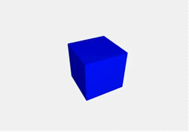

# WebVR
这是一篇关于怎么样基于three.js进行可配置的three.js的对象创建的文章
demo效果


主要文件在
```
app
  |--Oho
     |--index.js
     |--Pgae.js
  |--utils
     |--VRcore.js
     |--VRpage.js   
```
# 编写一个three.js的基类

这是创建的一个Three.js基类其中包含了场景，相机，渲染器，控制器以及一些方法

```js
  // VRcore.js
  import * as THREE from 'three';
  const OrbitControls = require('three-orbit-controls')(THREE)
  let Scene, Camera, Renderer, Controls, loopID;

  function createScene({domContainer = document.body, fov = 50,far = 1000}){
    if (!(domContainer instanceof HTMLElement)) {
      throw new Error('domContainer is not a HTMLElement!');
    }
    // 初始化 scene
    Scene = new THREE.Scene();
    // 初始化 camera
    Camera = new THREE.PerspectiveCamera(fov, domContainer.clientWidth / domContainer.clientHeight, 1, far);
    Camera.position.set( 200, 200, 200 );
    Camera.lookAt(Scene.position);
    Scene.add(Camera);
    // 初始化 renderer
    Renderer = new THREE.WebGLRenderer({ canvas: domContainer, antialias: true, alpha: true } );
    Renderer.clear();
    Renderer.setClearColor( 0xeeeeee, 1); // 更改渲染器颜色
    Renderer.setSize(domContainer.clientWidth, domContainer.clientHeight);
    Renderer.shadowMap.Enabled = true;
    Renderer.setPixelRatio(domContainer.devicePixelRatio);
    initVR();
  }

  function initVR() {
      // 初始化控制器
      Controls = new OrbitControls(Camera, Renderer.domElement);;
      Controls.addEventListener('change', render);
      Controls.enableZoom = true;
  }

  function render() {
    Renderer.render(Scene, Camera);
  }

  function renderStart(callback) {
    loopID = 0; // 记录循环几次，后面有与清除场景中的物体
    if (loopID === -1) return;
    let animate = function(){
      loopID = requestAnimationFrame(animate);
      callback();
      Controls.update();
      render();
    }
    animate();
  }

  // 暂停动画渲染
  function renderStop() {
    if (loopID !== -1) {
        window.cancelAnimationFrame(loopID);
        loopID = -1;
    }
  }
  // 回收当前场景
  function clearScene() {
    for(let i = Scene.children.length - 1; i >= 0; i-- ) {
        Scene.remove(Scene.children[i]);
    }
  }
  // 清理页面
  function cleanPage() {
    renderStop();
    clearScene();
  }

  export {
    Scene,
    Camera,
    Renderer,
    Controls,
    createScene,
    initVR,
    renderStart,
    renderStop,
    clearScene,
    cleanPage
  }
```

# 创建一个VRpage基类

这是一个VRpage的基类，所有需要创建Three项目都需要继承这个类，然后生成一个Three项目

```js
  // VRpage.js
  import * as THREE from 'three';
  import * as VRcore from './VRcore.js';

  export default class VRpage {
    constructor(options) {
      // 创建场景
      VRcore.createScene(options);
      this.start();
      this.loadPage();
    }
    loadPage() {
      VRcore.renderStart(() => this.update());
      this.loaded();
    }
    initPage() {
      this.loadPage();
      this.start();
    }
    start() {}
    loaded() {}
    update() {}
  }
```

# 生成一个Three.js的项目

下面的文件是一个继承了VRpage类的一个类，然后我们重写了start方法以及update方法，start方法中我们向场景中添加了一个正方体，update方法是我们给这个正方体的一个变形动画，他会结合VRcore.js里面的renderStart方法来进行动画效果
```js
  // page.js
  import * as THREE from 'three';
  import VRpage from '../../utils/VRpage.js';
  import * as VRcore from '../../utils/VRcore.js';

  export default class Page extends VRpage {
    start() { // 启动渲染之前，创建场景3d模型
      let geometry = new THREE.CubeGeometry(100,100,100);
      let material = new THREE.MeshLambertMaterial( { color:0x0000ff} );
      this.box = new THREE.Mesh(geometry,material);
      this.box.position.set(3, -2, -3);
      const PointLight = new THREE.PointLight(0xffffff);
      PointLight.position.set(500, 500, 500);
      const AmbientLight = new THREE.AmbientLight( 0x404040 ); // soft white light
      VRcore.Scene.add(PointLight);
      VRcore.Scene.add(AmbientLight);
      VRcore.Scene.background = new THREE.Color( 0xeeeeee ); // 更改场景背景色
      VRcore.Scene.add(this.box);
    }
    update() {
      this.box.rotation.y += 0.01;
    }
  }
```
这里我使用的是react的框架

```js 
  // index.js
  import React, { Component } from 'react';
  import PropTypes from 'prop-types';
  import Page from './Page.js';
  class Oho extends Component {
    constructor() {
      super();
      this.init = this.init.bind(this);
    }

    componentDidMount() {
      const dom = document.querySelector('#Oho');
      this.init(dom);
    }

    init(dom) {
      const page = new Page({domContainer: dom});
    }

    render() {
      return (
        <div className="three-demo">
          <canvas id="Oho" ref="camera"></canvas>
        </div>
      );
    }
  }

  export default Oho;
```